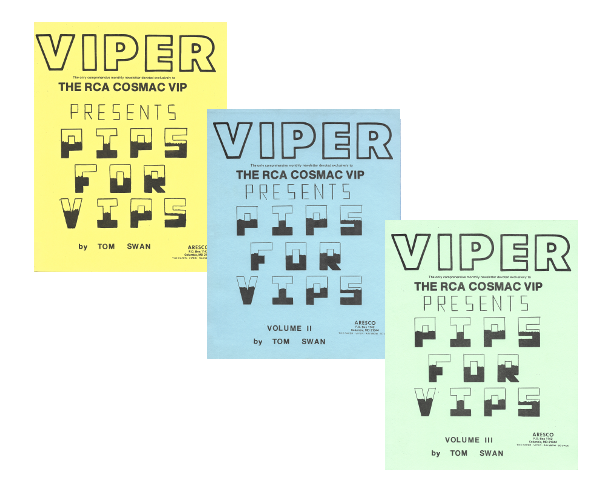

// README.adoc

= Pips for VIPs

by Tom Swan

In this repository are replicas of the first three books that I ever wrote, "Pips for VIPs" volumes I, II, and III, published by Aresco. The listings in the books' pages contain a mixture of 1802 machine language and CHIP-8 "threaded" code, an interpreted symbolic language designed for controlling the Cosmac VIP computer and the 1802, both manufactured by RCA in the 1970s.

I offer these digitized copies of what is now probably considered vintage material in hopes of preserving a very small piece of computer history of what significance I do not know or question. (To me it is all invaluable of course.) But if this repository helps keep alive even a small interest in the elements that ignited my career in computer journalism -- CHIP-8, the 1802 microprocessor, and the Cosmac VIP computer, not to forget the Viper newsletter -- then I am happy to be able to contribute this collection from my past into the hands and minds of my current and future fans.

Thank you for your many years of support.

Tom Swan 

April 20, 2020

- - -

PS: I did not proofread any of the scanned documents. Please report any errors.

PPS: If you get any of my programs up and running, please let me know. It seems odd now, but I used a semi-pro reel-to-reel 4-track Teac to record my Cosmac files, segmented with splicing tape! None survives.

PPPS: If you make or have made a donation to my web site, email me about what CHIP-8 means. I'll write back with my answer privately. I can't be 100% sure that I'm right, but I think I am.

PPPPS: The above offer does not appear anywhere else! Share with care.

PPPPPS: I will never delete this URL address so feel free to link to it.

SSSSSST: Enough already with the Ps...

- - -

// -----------------------------------------------------------------

== Pips for VIPs -- The Story

I became enthralled (and that says it) with computer programming while I was business manager for Clair Brothers Audio, then and now the leading name in concert sound, in Lititz Pennsylvania, where I grew up. The company's client list resembled a Rock and Roll Hall of Fame roster and I regularly handled calls from the crews and management for touring artists such as Elton John, Queen, Chicago, Rod Stewart, Peter Frampton..., on and on with never a non-familiar name appearing.

How such a company came to exist in a little farm town surrounded by Amish villages is another story. A really cool story -- for another time. Hint: Watch The Jersey Boys!

Please don't think I'm dropping names in order to boast -- my job was to handle the payroll and to help with the logistics of trucks and planes and crew members. I almost never got to go to concerts, and I did not hardly ever talk to the stars. Bette Midler chewed me out once after I broke all her stage lights by leasing the wrong kind of truck. I thank her silently in my mind for that regularly. After you get chewed out by Bette Midler, there is nothing anybody can say to get to you. It gives one a certain kind of immunity.

The reason that I bring up rock and roll is because digital audio was just around the corner in those days, the mid 1970s, and the company had purchased a PDP-8 microcomputer with a huge Dec line printer that was as big as the desk at which I am now working. The stated intention for the purchase was to develop digital audio circuitry and to experiment with digital delays -- a notion that would soon change outdoor concert sound forever. But we all mostly played Lunar Lander on it, burning though a small forest of green-lined computer paper with sheets as wide as full pages of The New York Times. I had to order ream after ream of folded paper and I remember hoping the accountant wouldn't call me out for the extra expense.

One fine day, I was encouraged to purchase directly from RCA a Cosmac VIP hobbyist kit, one of the three needed to qualify for a discount. Two talented sound engineers for the group Chicago and for Elvis Presley respectively, David Hendel and Bruce Jackson, cornered me into joining them in placing the order. I actually had little interest in the kit -- my friends, however, were eager for it and they coaxed me into becoming a third partner to get the discount. I was already smitten with the fancy PDP-8 and I had by then mastered its BASIC instruction manual late at night when I often returned to play computer games alone and to try out coding ideas, but even so I went along half-heartedly with my friends, thinking the Cosmac was probably just another very cool but probably useless toy, and never realizing that the $200 or so (list was $275) that I had just spent would be the wisest investment I ever made, and probably ever will.

(I told you the roster board was impressive! Not only did the company handle sound for all Presley shows, but for various reasons shared equipment with another legend, Johnny Cash, meaning they could never tour on the same dates! I did go to one Elvis concert in Philadelphia. No, I did not meet The King. Dang.)

Time passed while my digital addiction consumed me. I quit my job and moved to southern Mexico up in the Sierra mountain chains in the silver-mining and jewelry capital town of Taxco. We drank cheap bottles of Corona while I inhaled code and snacked on algorithms. I intended to write the Great American Novel, but I instead mostly studied Lisp, Pascal, Forth, Fortran, Basic, Mix, and of course 1802 and CHIP-8. Believe it or not, I wrote a functional Mix interpreter in 1802 assembly language. I have no idea what became of it, but it correctly executed many of Knuth's algorithms. Soon I gave up story writing and turned entirely to code and then, for the next 30 years, to writing about code and programming.

My wife at the time, Anne, and I hand typed the entire Pips for VIPs texts on a portable Smith Corona typewriter in our apartment in Taxco, where I wrote the books originally by hand in pencil (my working preference then). Final copies of the entire manuscripts, including all listings, were then re-typed by the two of us from relatively cheap newsprint drafts onto 100% cotton paper imported from San Antonio -- I can't remember why that was so important to me; I remember only that it was. My friend Bill Alexander flew two reams of it with him from Texas to Mexico City, as he had done before with all three of Knuth's heavy college-level texts, The Art of Computer Science. The lone original Pips manuscript was sent to the publisher. I don't know what happened to it. I devoured Knuth, absorbing everything I could except for the mathematical proofs, in which I had no interest.

Absolutely no editing was done to any of the Pips texts before publication. It was never typeset, but was published directly from my typed final manuscript pages. Although I have since worked with many of the finest and most talented editors in the computer publishing business, I am proud that all of the words in my very first books went unchanged from me directly to my readers.

Today, such a connection between writers and readers is not so very unusual. (Like here!) Back then, it was unheard of.

I am also eternally grateful to Anne for her tireless proof reading of the manuscript. I probably never said thank you properly. She caught many many errors that I missed, all the while reading material that must have made little if any sense to her. (She never had any personal interest in programming languages.)

- - -

// -----------------------------------------------------------------

== What's a Pips Exactly?? 

The title stands for "Pretty Impressive Programs for Very Important..." People or Programmers. You pick. PS: I did not coin the title Pips for VIPs: Terry L came up with that and, I think, drew the cover. Aresco stands for R S Co.)

Not long ago, I found copies of each published volume, neglected for many years, during a multi-state move. Volumes II and III were in their original plastic bags and are in perfect condition. Volume I was the review copy I received from the publisher in a binder in loose leaf form. All pages have punch holes, which are seen in the images. I had all pages scanned professionally to produce the files in this repository.

I also received as a gift from Aresco after the popular success of the first book, a leather-bound copy of Volume I, which I still have, inscribed inside the front cover by the editor:

"Your first book -- my first book -- and our whole lives change! Regards - Terry L Laudereau"

- - -

// -----------------------------------------------------------------

== About the Files

* images -- JPEG files for each page
* Non OCR Full File -- facsimile copies of each volume
* Volume 1/3 -- OCR converted pages in PDF format
* pips-composite.png -- graphics image for README
* README.adoc -- you are here!
* Volume 1/3 HTML.htm -- open to view images in a browser

- - -

// -----------------------------------------------------------------

== Some Music

https://www.youtube.com/watch?v=C_HNXafYz6k

- - -

// -----------------------------------------------------------------

== More Information

For more stuff, please browse my repositories on GitHub. It's where I store all of my downloads, files and example programs, new and old. Everything is free for the taking. 

Please also follow the links below to visit my web site, GitHub and YouTube channels. Write to me at tom@tomswan.com. Suggestions and comments on my work are _always appreciated._ I remain committed to exploring computer and music topics and then writing and making videos about what I manage to learn. Please tune in! Good luck!

Program Listings: https://github.com/TomSwan/collections

Website: https://www.tomswan.com

GitHub: https://github.com/TomSwan

YouTube: https://www.youtube.com/user/TomSwanPlaysGuitar

* Say it fast: 10 Q (thank you!)
